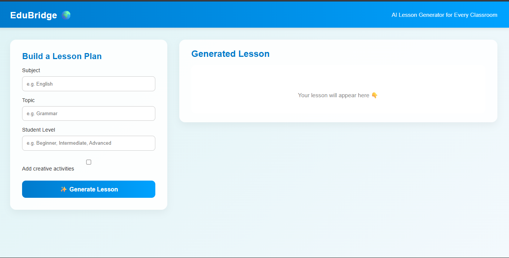
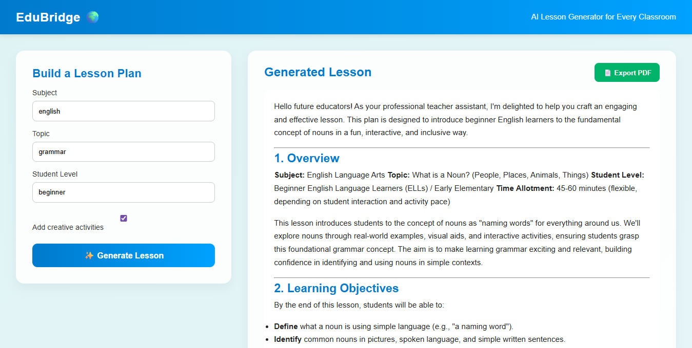
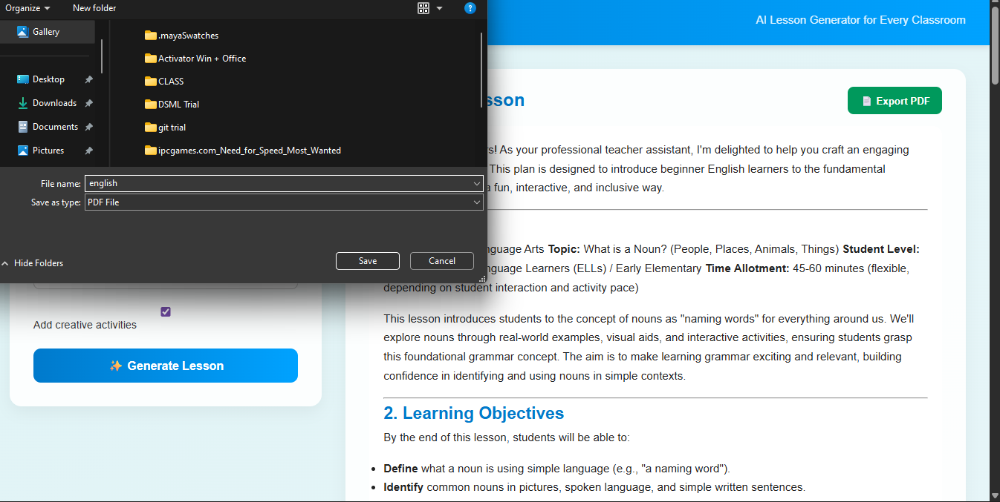

# EduBridge — Personalized Lesson Generator for Low-Resource Schools

EduBridge is a web application designed to help teachers and students with limited resources quickly generate high-quality, personalized lesson plans. The platform uses AI-powered models (Gemini) to create lessons, examples, and practice questions tailored to the subject, topic, and student level.

---
## Live Demo
Check out the live demo here: [EduBridge Live Demo](https://vercel.com/jeissy4s-projects/edu-bridge)


## Table of Contents
- [Features](#features)
- [Tech Stack](#tech-stack)
- [Project Structure](#project-structure)
- [Setup & Installation](#setup--installation)
- [Usage](#usage)
- [Contributing](#contributing)
- [License](#license)

---

## Features
- **Custom Lesson Plans**: Input subject, topic, and student level to generate lessons.
- **Adaptive Difficulty**: Lessons adjust to the specified student level.
- **Creative Examples & Activities**: Incorporates games, real-world examples, and exercises.
- **Export PDF**: Teachers can export generated lessons as a PDF.
- **Equitable Access**: Supports low-resource schools and teachers.
- **Productivity**: Saves time on lesson preparation.

---
## Screenshots

### Landing Page / Form


### Generated Lesson Output


### Export PDF Example



## Tech Stack
- **Frontend**: React.js  
- **Styling**: CSS  
- **Markdown Rendering**: `react-markdown`  
- **PDF Export**: `html2pdf.js`  
- **AI Model**: Gemini (via API)  

---

## Project Structure

```
edubridge/
├─ src/
│  ├─ components/
│  │  ├─ LessonForm.jsx      # Form for inputting subject, topic, and level
│  │  ├─ LessonOutput.jsx    # Displays the generated lesson & export button
│  │  └─ Navbar.jsx          # App navigation bar
│  ├─ App.jsx                # Main App component
│  ├─ main.jsx               # Entry point for React
│  └─ dashboard.css          # Styling for components
├─ screenshots/              # Screenshots for README
│  ├─ landing-page.png
│  ├─ lesson-output.png
│  └─ export-pdf.png
├─ index.html                # Main HTML file
├─ package.json              # Project metadata and dependencies
├─ package-lock.json         # Exact versions of installed dependencies
└─ vite.config.js            # Vite configuration file

```

---

## Setup & Installation

1. **Clone the repository**
```bash
git clone <your-repo-url>
cd edubridge
```
2. **Install dependencies**
```bash
npm install

```
3. **Configure Gemini API Key**
Create a .env file in the project root:
```bash
VITE_GEMINI_API_KEY=your_api_key_here

```

4. **Start the development server**
```bash
npm run dev
```

Usage
---
1.Open the app in your browser (http://localhost:5173 by default).

2.Fill in the Subject, Topic, and Student Level fields.

3.Click Generate Lesson to see the lesson plan, examples, and exercises.

4.Optionally, export the lesson as a PDF using the Export PDF button.


Contributing
---

Contributions are welcome!

Fork the repository

Create a new branch (git checkout -b feature-name)

Make your changes

Commit and push (git commit -am 'Add new feature' && git push origin feature-name)

Create a pull request

License
---

This project is licensed under the MIT License.

Acknowledgements
---

OpenAI Gemini
 for AI-powered content generation

Educators and teachers who inspire social-good AI projects


